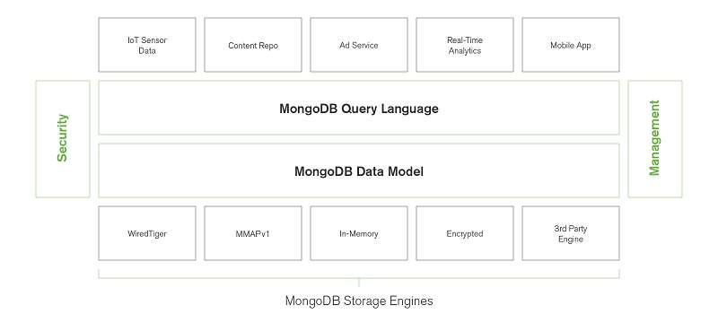

# 概念
主要说明一些mongodb概念， 不涉及代码部分。

# 基本介绍
MongoDB是一个基于分布式文件存储的数据库。由C++语言编写。旨在为WEB应用提供可扩展的高性能数据存储解决方案。
MongoDB是一个介于关系数据库和非关系数据库之间的产品，是非关系数据库当中功能最丰富，最像关系数据库的。它支持的数据结构非常松散，是类似json的bson格式，因此可以存储比较复杂的数据类型。Mongo最大的特点是它支持的查询语言非常强大，其语法有点类似于面向对象的查询语言，几乎可以实现类似关系数据库单表查询的绝大部分功能，而且还支持对数据建立索引。-来源百度百科

# 组织架构图

# 版本及历史
目前mongodb文档版本是5.0。 待完善

# 帮组文档
- [官方文档](https://docs.mongodb.com/develop-applications/?_ga=2.26720376.439624809.1640228467-1833695404.1634181221)：基本在使用上问题基本都能查到
- [jira](https://jira.mongodb.org/)： 可以查询些代码修改时的信息以及版本，还有一些未来的功能

