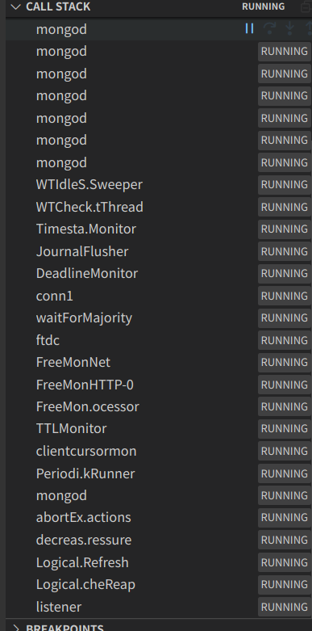

# 启动流程
接下来就是源码的第一篇了，主要看下mongodb server的启动流程。

## 先启动起来
发现启动了多个线程。mongod是server线程，connx是client连接线程，其他的后面慢慢接触。

## 寻找main
一般都是`int main()`, 发现在db.cpp下面
```cpp
// 启动入口
int main(int argc, char* argv[], char** envp) {
    int exitCode = mongo::mongoDbMain(argc, argv, envp);
    mongo::quickExit(exitCode);
}

int mongoDbMain(int argc, char* argv[], char** envp) {
    // 单线程保证
    ThreadSafetyContext::getThreadSafetyContext()->forbidMultiThreading();
    // 注册退出函数
    registerShutdownTask(shutdownTask);
    // 处理信号量
    setupSignalHandlers();
    // 生成随机数？
    srand(static_cast<unsigned>(curTimeMicros64()));

    // 执行初始化
    Status status = mongo::runGlobalInitializers(argc, argv, envp);
    if (!status.isOK()) {
        LOGV2_FATAL_OPTIONS(
            20574,
            logv2::LogOptions(logv2::LogComponent::kControl, logv2::FatalMode::kContinue),
            "Error during global initialization: {error}",
            "Error during global initialization",
            "error"_attr = status);
        quickExit(EXIT_FAILURE);
    }
    // 匿名函数 生成ServiceContext对象
    auto* service = [] {
        try {
            auto serviceContextHolder = ServiceContext::make();
            auto* serviceContext = serviceContextHolder.get();
            setGlobalServiceContext(std::move(serviceContextHolder));

            return serviceContext;
        } catch (...) {
            auto cause = exceptionToStatus();
            LOGV2_FATAL_OPTIONS(
                20575,
                logv2::LogOptions(logv2::LogComponent::kControl, logv2::FatalMode::kContinue),
                "Error creating service context: {error}",
                "Error creating service context",
                "error"_attr = redact(cause));
            quickExit(EXIT_FAILURE);
        }
    }();
    // 给service设置各种属性
    setUpCollectionShardingState(service);
    setUpCatalog(service);
    setUpReplication(service);
    setUpObservers(service);
    service->setServiceEntryPoint(std::make_unique<ServiceEntryPointMongod>(service));

    ErrorExtraInfo::invariantHaveAllParsers();

    startupConfigActions(std::vector<std::string>(argv, argv + argc));
    cmdline_utils::censorArgvArray(argc, argv);
    // 检查pid文件是否有权限
    if (!initializeServerGlobalState(service))
        quickExit(EXIT_FAILURE);
    // 安全检查
    if (!initializeServerSecurityGlobalState(service))
        quickExit(EXIT_FAILURE);

    // 允许多线程
    ThreadSafetyContext::getThreadSafetyContext()->allowMultiThreading();

    // Per SERVER-7434, startSignalProcessingThread must run after any forks (i.e.
    // initializeServerGlobalState) and before the creation of any other threads
    // 启动 SignalHandler 线程 主要监听信号量 触发对应的事件
    startSignalProcessingThread();

    ReadWriteConcernDefaults::create(service, readWriteConcernDefaultsCacheLookupMongoD);
    // 监听端口并启动线程
    ExitCode exitCode = initAndListen(service, serverGlobalParams.port);
    exitCleanly(exitCode);
    return 0;
}


```
## _initAndListen
接下来就是比较复杂的`_initAndListen`
```cpp
ExitCode _initAndListen(ServiceContext* serviceContext, int listenPort) {
    Client::initThread("initandlisten");

    initWireSpec();

    serviceContext->setFastClockSource(FastClockSourceFactory::create(Milliseconds(10)));

    DBDirectClientFactory::get(serviceContext).registerImplementation([](OperationContext* opCtx) {
        return std::unique_ptr<DBClientBase>(new DBDirectClient(opCtx));
    });

    const repl::ReplSettings& replSettings =
        repl::ReplicationCoordinator::get(serviceContext)->getSettings();

    {
        ProcessId pid = ProcessId::getCurrent();
        const bool is32bit = sizeof(int*) == 4;
        LOGV2(4615611,
              "MongoDB starting : pid={pid} port={port} dbpath={dbPath} {architecture} host={host}",
              "MongoDB starting",
              "pid"_attr = pid.toNative(),
              "port"_attr = serverGlobalParams.port,
              "dbPath"_attr = boost::filesystem::path(storageGlobalParams.dbpath).generic_string(),
              "architecture"_attr = (is32bit ? "32-bit" : "64-bit"),
              "host"_attr = getHostNameCached());
    }

    if (kDebugBuild)
        LOGV2_OPTIONS(20533, {LogComponent::kControl}, "DEBUG build (which is slower)");

#if defined(_WIN32)
    VersionInfoInterface::instance().logTargetMinOS();
#endif

    logProcessDetails(nullptr);

    serviceContext->setServiceEntryPoint(std::make_unique<ServiceEntryPointMongod>(serviceContext));

    // Set up the periodic runner for background job execution. This is required to be running
    // before both the storage engine or the transport layer are initialized.
    auto runner = makePeriodicRunner(serviceContext);
    serviceContext->setPeriodicRunner(std::move(runner));

#ifdef MONGO_CONFIG_SSL
    OCSPManager::get()->startThreadPool();
#endif

    if (!storageGlobalParams.repair) {
        auto tl =
            transport::TransportLayerManager::createWithConfig(&serverGlobalParams, serviceContext);
        auto res = tl->setup();
        if (!res.isOK()) {
            LOGV2_ERROR(20568,
                        "Error setting up listener: {error}",
                        "Error setting up listener",
                        "error"_attr = res);
            return EXIT_NET_ERROR;
        }
        serviceContext->setTransportLayer(std::move(tl));
    }

    FlowControl::set(serviceContext,
                     std::make_unique<FlowControl>(
                         serviceContext, repl::ReplicationCoordinator::get(serviceContext)));

    auto lastStorageEngineShutdownState =
        initializeStorageEngine(serviceContext, StorageEngineInitFlags::kNone);
    StorageControl::startStorageControls(serviceContext);

#ifdef MONGO_CONFIG_WIREDTIGER_ENABLED
    if (EncryptionHooks::get(serviceContext)->restartRequired()) {
        exitCleanly(EXIT_CLEAN);
    }
#endif

    // Warn if we detect configurations for multiple registered storage engines in the same
    // configuration file/environment.
    if (serverGlobalParams.parsedOpts.hasField("storage")) {
        BSONElement storageElement = serverGlobalParams.parsedOpts.getField("storage");
        invariant(storageElement.isABSONObj());
        for (auto&& e : storageElement.Obj()) {
            // Ignore if field name under "storage" matches current storage engine.
            if (storageGlobalParams.engine == e.fieldName()) {
                continue;
            }

            // Warn if field name matches non-active registered storage engine.
            if (isRegisteredStorageEngine(serviceContext, e.fieldName())) {
                LOGV2_WARNING(20566,
                              "Detected configuration for non-active storage engine {fieldName} "
                              "when current storage engine is {storageEngine}",
                              "Detected configuration for non-active storage engine",
                              "fieldName"_attr = e.fieldName(),
                              "storageEngine"_attr = storageGlobalParams.engine);
            }
        }
    }

    // Disallow running a storage engine that doesn't support capped collections with --profile
    if (!serviceContext->getStorageEngine()->supportsCappedCollections() &&
        serverGlobalParams.defaultProfile != 0) {
        LOGV2_ERROR(20534,
                    "Running {storageEngine} with profiling is not supported. Make sure you "
                    "are not using --profile",
                    "Running the selected storage engine with profiling is not supported",
                    "storageEngine"_attr = storageGlobalParams.engine);
        exitCleanly(EXIT_BADOPTIONS);
    }

    // Disallow running WiredTiger with --nojournal in a replica set
    if (storageGlobalParams.engine == "wiredTiger" && !storageGlobalParams.dur &&
        replSettings.usingReplSets()) {
        LOGV2_ERROR(
            20535,
            "Running wiredTiger without journaling in a replica set is not supported. Make sure "
            "you are not using --nojournal and that storage.journal.enabled is not set to "
            "'false'");
        exitCleanly(EXIT_BADOPTIONS);
    }

    logMongodStartupWarnings(storageGlobalParams, serverGlobalParams, serviceContext);

    {
        std::stringstream ss;
        ss << endl;
        ss << "*********************************************************************" << endl;
        ss << " ERROR: dbpath (" << storageGlobalParams.dbpath << ") does not exist." << endl;
        ss << " Create this directory or give existing directory in --dbpath." << endl;
        ss << " See http://dochub.mongodb.org/core/startingandstoppingmongo" << endl;
        ss << "*********************************************************************" << endl;
        uassert(10296, ss.str().c_str(), boost::filesystem::exists(storageGlobalParams.dbpath));
    }

    initializeSNMP();

    startWatchdog();

    if (!storageGlobalParams.readOnly) {
        boost::filesystem::remove_all(storageGlobalParams.dbpath + "/_tmp/");
    }

    if (mongodGlobalParams.scriptingEnabled) {
        ScriptEngine::setup();
    }

    auto startupOpCtx = serviceContext->makeOperationContext(&cc());

    bool canCallFCVSetIfCleanStartup =
        !storageGlobalParams.readOnly && (storageGlobalParams.engine != "devnull");
    if (canCallFCVSetIfCleanStartup && !replSettings.usingReplSets()) {
        Lock::GlobalWrite lk(startupOpCtx.get());
        FeatureCompatibilityVersion::setIfCleanStartup(startupOpCtx.get(),
                                                       repl::StorageInterface::get(serviceContext));
    }

    bool nonLocalDatabases;
    try {
        nonLocalDatabases = repairDatabasesAndCheckVersion(startupOpCtx.get());
    } catch (const ExceptionFor<ErrorCodes::MustDowngrade>& error) {
        LOGV2_FATAL_OPTIONS(
            20573,
            logv2::LogOptions(logv2::LogComponent::kControl, logv2::FatalMode::kContinue),
            "** IMPORTANT: {error}",
            "Wrong mongod version",
            "error"_attr = error.toStatus().reason());
        exitCleanly(EXIT_NEED_DOWNGRADE);
    }

    auto replProcess = repl::ReplicationProcess::get(serviceContext);
    invariant(replProcess);
    const bool initialSyncFlag =
        replProcess->getConsistencyMarkers()->getInitialSyncFlag(startupOpCtx.get());

    // Assert that the in-memory featureCompatibilityVersion parameter has been explicitly set. If
    // we are part of a replica set and are started up with no data files, we do not set the
    // featureCompatibilityVersion until a primary is chosen. For this case, we expect the in-memory
    // featureCompatibilityVersion parameter to still be uninitialized until after startup. If the
    // initial sync flag is set and we are part of a replica set, we expect the version to be
    // initialized as part of initial sync after startup.
    const bool initializeFCVAtInitialSync = replSettings.usingReplSets() && initialSyncFlag;
    if (canCallFCVSetIfCleanStartup && (!replSettings.usingReplSets() || nonLocalDatabases) &&
        !initializeFCVAtInitialSync) {
        invariant(serverGlobalParams.featureCompatibility.isVersionInitialized());
    }

    if (gFlowControlEnabled.load()) {
        LOGV2(20536, "Flow Control is enabled on this deployment");
    }

    // Notify the storage engine that startup is completed before repair exits below, as repair sets
    // the upgrade flag to true.
    serviceContext->getStorageEngine()->notifyStartupComplete();

    if (storageGlobalParams.upgrade) {
        LOGV2(20537, "Finished checking dbs");
        exitCleanly(EXIT_CLEAN);
    }

    // Start up health log writer thread.
    HealthLog::get(startupOpCtx.get()).startup();

    auto const globalAuthzManager = AuthorizationManager::get(serviceContext);
    uassertStatusOK(globalAuthzManager->initialize(startupOpCtx.get()));

    // This is for security on certain platforms (nonce generation)
    srand((unsigned)(curTimeMicros64()) ^ (unsigned(uintptr_t(&startupOpCtx))));

    if (globalAuthzManager->shouldValidateAuthSchemaOnStartup()) {
        Status status = verifySystemIndexes(startupOpCtx.get());
        if (!status.isOK()) {
            LOGV2_WARNING(20538,
                          "Unable to verify system indexes: {error}",
                          "Unable to verify system indexes",
                          "error"_attr = redact(status));
            if (status == ErrorCodes::AuthSchemaIncompatible) {
                exitCleanly(EXIT_NEED_UPGRADE);
            } else if (status == ErrorCodes::NotWritablePrimary) {
                // Try creating the indexes if we become master.  If we do not become master,
                // the master will create the indexes and we will replicate them.
            } else {
                quickExit(EXIT_FAILURE);
            }
        }

        // SERVER-14090: Verify that auth schema version is schemaVersion26Final.
        int foundSchemaVersion;
        status =
            globalAuthzManager->getAuthorizationVersion(startupOpCtx.get(), &foundSchemaVersion);
        if (!status.isOK()) {
            LOGV2_ERROR(
                20539,
                "Auth schema version is incompatible: User and role management commands require "
                "auth data to have at least schema version {minSchemaVersion} but startup could "
                "not verify schema version: {error}",
                "Failed to verify auth schema version",
                "minSchemaVersion"_attr = AuthorizationManager::schemaVersion26Final,
                "error"_attr = status);
            LOGV2(20540,
                  "To manually repair the 'authSchema' document in the admin.system.version "
                  "collection, start up with --setParameter "
                  "startupAuthSchemaValidation=false to disable validation");
            exitCleanly(EXIT_NEED_UPGRADE);
        }

        if (foundSchemaVersion <= AuthorizationManager::schemaVersion26Final) {
            LOGV2_ERROR(
                20541,
                "This server is using MONGODB-CR, an authentication mechanism which has been "
                "removed from MongoDB 4.0. In order to upgrade the auth schema, first downgrade "
                "MongoDB binaries to version 3.6 and then run the authSchemaUpgrade command. See "
                "http://dochub.mongodb.org/core/3.0-upgrade-to-scram-sha-1");
            exitCleanly(EXIT_NEED_UPGRADE);
        }
    } else if (globalAuthzManager->isAuthEnabled()) {
        LOGV2_ERROR(20569, "Auth must be disabled when starting without auth schema validation");
        exitCleanly(EXIT_BADOPTIONS);
    } else {
        // If authSchemaValidation is disabled and server is running without auth,
        // warn the user and continue startup without authSchema metadata checks.
        LOGV2_WARNING_OPTIONS(
            20543,
            {logv2::LogTag::kStartupWarnings},
            "** WARNING: Startup auth schema validation checks are disabled for the database");
        LOGV2_WARNING_OPTIONS(
            20544,
            {logv2::LogTag::kStartupWarnings},
            "**          This mode should only be used to manually repair corrupted auth data");
    }

    WaitForMajorityService::get(serviceContext).setUp(serviceContext);

    // This function may take the global lock.
    auto shardingInitialized = ShardingInitializationMongoD::get(startupOpCtx.get())
                                   ->initializeShardingAwarenessIfNeeded(startupOpCtx.get());
    if (shardingInitialized) {
        auto status = waitForShardRegistryReload(startupOpCtx.get());
        if (!status.isOK()) {
            LOGV2(20545,
                  "Error loading shard registry at startup {error}",
                  "Error loading shard registry at startup",
                  "error"_attr = redact(status));
        }
    }

    try {
        if (serverGlobalParams.clusterRole != ClusterRole::ShardServer &&
            replSettings.usingReplSets()) {
            ReadWriteConcernDefaults::get(startupOpCtx.get()->getServiceContext())
                .refreshIfNecessary(startupOpCtx.get());
        }
    } catch (const DBException& ex) {
        LOGV2_WARNING(20567,
                      "Error loading read and write concern defaults at startup",
                      "error"_attr = redact(ex));
    }
    readWriteConcernDefaultsMongodStartupChecks(startupOpCtx.get());

    auto storageEngine = serviceContext->getStorageEngine();
    invariant(storageEngine);
    BackupCursorHooks::initialize(serviceContext, storageEngine);

    // Perform replication recovery for queryable backup mode if needed.
    if (storageGlobalParams.readOnly) {
        uassert(ErrorCodes::BadValue,
                str::stream() << "Cannot specify both queryableBackupMode and "
                              << "recoverFromOplogAsStandalone at the same time",
                !replSettings.shouldRecoverFromOplogAsStandalone());
        uassert(
            ErrorCodes::BadValue,
            str::stream()
                << "Cannot take an unstable checkpoint on shutdown while using queryableBackupMode",
            !gTakeUnstableCheckpointOnShutdown);
        uassert(5576603,
                str::stream() << "Cannot specify both queryableBackupMode and "
                              << "startupRecoveryForRestore at the same time",
                !repl::startupRecoveryForRestore);

        auto replCoord = repl::ReplicationCoordinator::get(startupOpCtx.get());
        invariant(replCoord);
        uassert(ErrorCodes::BadValue,
                str::stream() << "Cannot use queryableBackupMode in a replica set",
                !replCoord->isReplEnabled());
        replCoord->startup(startupOpCtx.get(), lastStorageEngineShutdownState);
    }

    if (!storageGlobalParams.readOnly) {

        if (storageEngine->supportsCappedCollections()) {
            logStartup(startupOpCtx.get());
        }

        startMongoDFTDC();

        startFreeMonitoring(serviceContext);

        auto replCoord = repl::ReplicationCoordinator::get(startupOpCtx.get());
        invariant(replCoord);

        if (serverGlobalParams.clusterRole == ClusterRole::ShardServer) {
            // Note: For replica sets, ShardingStateRecovery happens on transition to primary.
            if (!replCoord->isReplEnabled()) {
                if (ShardingState::get(startupOpCtx.get())->enabled()) {
                    uassertStatusOK(ShardingStateRecovery::recover(startupOpCtx.get()));
                }
            }
        } else if (serverGlobalParams.clusterRole == ClusterRole::ConfigServer) {
            initializeGlobalShardingStateForMongoD(startupOpCtx.get(),
                                                   ConnectionString::forLocal(),
                                                   kDistLockProcessIdForConfigServer);

            Balancer::create(startupOpCtx->getServiceContext());

            ShardingCatalogManager::create(
                startupOpCtx->getServiceContext(),
                makeShardingTaskExecutor(executor::makeNetworkInterface("AddShard-TaskExecutor")));

            Grid::get(startupOpCtx.get())->setShardingInitialized();
        } else if (replSettings.usingReplSets()) {  // standalone replica set
            auto keysCollectionClient = std::make_unique<KeysCollectionClientDirect>();
            auto keyManager = std::make_shared<KeysCollectionManager>(
                KeysCollectionManager::kKeyManagerPurposeString,
                std::move(keysCollectionClient),
                Seconds(KeysRotationIntervalSec));
            keyManager->startMonitoring(startupOpCtx->getServiceContext());

            LogicalTimeValidator::set(startupOpCtx->getServiceContext(),
                                      std::make_unique<LogicalTimeValidator>(keyManager));

            ReplicaSetNodeProcessInterface::getReplicaSetNodeExecutor(serviceContext)->startup();
        }

        replCoord->startup(startupOpCtx.get(), lastStorageEngineShutdownState);
        // 'getOldestActiveTimestamp', which is called in the background by the checkpoint thread,
        // requires a read on 'config.transactions' at the stableTimestamp. If this read occurs
        // while applying prepared transactions at the end of replication recovery, it's possible to
        // prepare a transaction at timestamp earlier than the stableTimestamp. This will result in
        // a WiredTiger invariant. Register the callback after the call to 'startup' to ensure we've
        // finished applying prepared transactions.
        if (replCoord->isReplEnabled()) {
            storageEngine->setOldestActiveTransactionTimestampCallback(
                TransactionParticipant::getOldestActiveTimestamp);
        }

        if (getReplSetMemberInStandaloneMode(serviceContext)) {
            LOGV2_WARNING_OPTIONS(
                20547,
                {logv2::LogTag::kStartupWarnings},
                "Document(s) exist in 'system.replset', but started without --replSet. Database "
                "contents may appear inconsistent with the writes that were visible when this node "
                "was running as part of a replica set. Restart with --replSet unless you are doing "
                "maintenance and no other clients are connected. The TTL collection monitor will "
                "not start because of this. For more info see "
                "http://dochub.mongodb.org/core/ttlcollections");
        } else {
            startTTLBackgroundJob(serviceContext);
        }

        if (replSettings.usingReplSets() || !gInternalValidateFeaturesAsMaster) {
            serverGlobalParams.validateFeaturesAsMaster.store(false);
        }
    }

    startClientCursorMonitor();

    PeriodicTask::startRunningPeriodicTasks();

    SessionKiller::set(serviceContext,
                       std::make_shared<SessionKiller>(serviceContext, killSessionsLocal));

    // Start up a background task to periodically check for and kill expired transactions; and a
    // background task to periodically check for and decrease cache pressure by decreasing the
    // target size setting for the storage engine's window of available snapshots.
    //
    // Only do this on storage engines supporting snapshot reads, which hold resources we wish to
    // release periodically in order to avoid storage cache pressure build up.
    if (storageEngine->supportsReadConcernSnapshot()) {
        try {
            PeriodicThreadToAbortExpiredTransactions::get(serviceContext)->start();
            // The inMemory engine is not yet used for replica or sharded transactions in production
            // so it does not currently maintain snapshot history. It is live in testing, however.
            if (!storageEngine->isEphemeral() || getTestCommandsEnabled()) {
                PeriodicThreadToDecreaseSnapshotHistoryCachePressure::get(serviceContext)->start();
            }
        } catch (ExceptionFor<ErrorCodes::PeriodicJobIsStopped>&) {
            LOGV2_WARNING(4747501, "Not starting periodic jobs as shutdown is in progress");
            // Shutdown has already started before initialization is complete. Wait for the
            // shutdown task to complete and return.
            MONGO_IDLE_THREAD_BLOCK;
            return waitForShutdown();
        }
    }

    // Set up the logical session cache
    LogicalSessionCacheServer kind = LogicalSessionCacheServer::kStandalone;
    if (serverGlobalParams.clusterRole == ClusterRole::ShardServer) {
        kind = LogicalSessionCacheServer::kSharded;
    } else if (serverGlobalParams.clusterRole == ClusterRole::ConfigServer) {
        kind = LogicalSessionCacheServer::kConfigServer;
    } else if (replSettings.usingReplSets()) {
        kind = LogicalSessionCacheServer::kReplicaSet;
    }

    LogicalSessionCache::set(serviceContext, makeLogicalSessionCacheD(kind));

    initializeCommandHooks(serviceContext);

    // MessageServer::run will return when exit code closes its socket and we don't need the
    // operation context anymore
    startupOpCtx.reset();

    auto start = serviceContext->getServiceExecutor()->start();
    if (!start.isOK()) {
        LOGV2_ERROR(20570,
                    "Error starting service executor: {error}",
                    "Error starting service executor",
                    "error"_attr = start);
        return EXIT_NET_ERROR;
    }

    start = serviceContext->getServiceEntryPoint()->start();
    if (!start.isOK()) {
        LOGV2_ERROR(20571,
                    "Error starting service entry point: {error}",
                    "Error starting service entry point",
                    "error"_attr = start);
        return EXIT_NET_ERROR;
    }

    if (!storageGlobalParams.repair) {
        start = serviceContext->getTransportLayer()->start();
        if (!start.isOK()) {
            LOGV2_ERROR(20572,
                        "Error starting listener: {error}",
                        "Error starting listener",
                        "error"_attr = start);
            return EXIT_NET_ERROR;
        }
    }

    serviceContext->notifyStartupComplete();

#ifndef _WIN32
    mongo::signalForkSuccess();
#else
    if (ntservice::shouldStartService()) {
        ntservice::reportStatus(SERVICE_RUNNING);
        LOGV2(20555, "Service running");
    }
#endif

    if (MONGO_unlikely(shutdownAtStartup.shouldFail())) {
        LOGV2(20556, "Starting clean exit via failpoint");
        exitCleanly(EXIT_CLEAN);
    }

    MONGO_IDLE_THREAD_BLOCK;
    return waitForShutdown();
}
```


